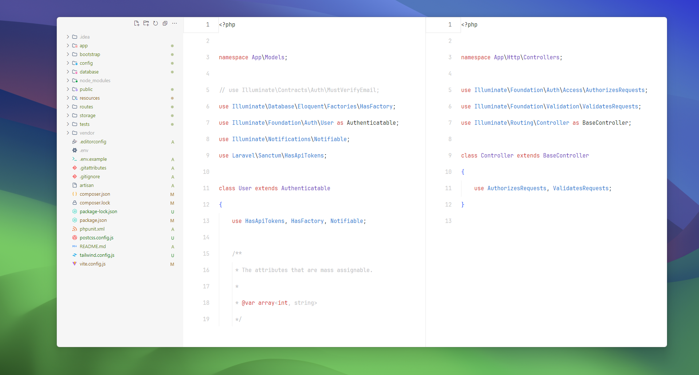
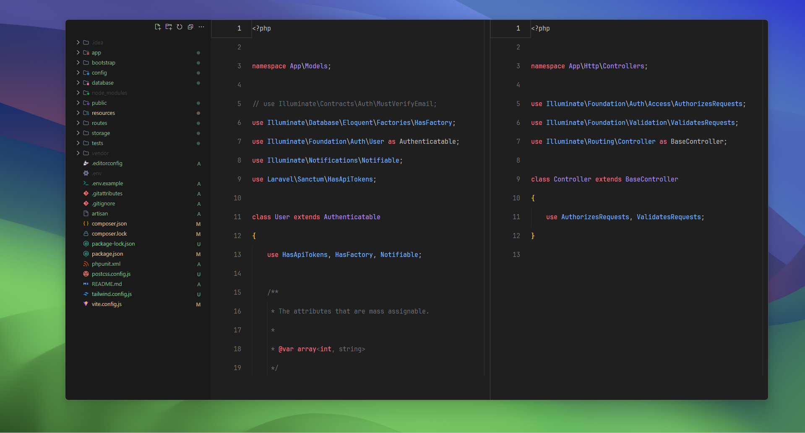

# vscode-MINIMAL-2024

# minimal-vscode
<p align="center">
  
</p>
settingsV2
<p align="center">
  
</p>

# Minimal Code

Minimal Code is a set of extensions, settings and keyboard shortcuts that turns Visual Studio Code into a minimal and productive development environment.  
It's focused on minimizing distractions, reducing mouse usage and optimizing the overall workflow.

## Installation

1. Install [Visual Studio Code](https://code.visualstudio.com/Download):
  ```bash
  brew install visual-studio-code
 ```
2. Install [Apc Customize UI++ UI](https://marketplace.visualstudio.com/items?itemName=drcika.apc-extension) theme: 


6. Install [Min Theme](https://marketplace.visualstudio.com/items?itemName=miguelsolorio.min-theme) theme: use and ligth
7. Install [Min Theme](https://marketplace.visualstudio.com/items?itemName=zhuangtongfa.Material-theme) theme: use and DARK   

8. Install [Symbols Icons](https://marketplace.visualstudio.com/items?itemName=miguelsolorio.symbols) extencion:


5. Install [JetBrains Mono](https://www.jetbrains.com/lp/mono/) font: USADO
6. Install [Victor Mono](https://rubjo.github.io/victor-mono/VictorMonoAll.zip) Font: ALTERNATIVO

7. Copy the contents of [`src/settings.json`](src/settings.json) to your settings file (search **Preferences: Open Settings (JSON)** using the Command Palette).

## Screenshots



